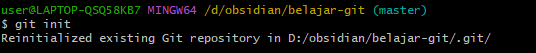
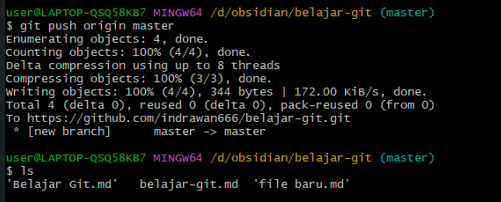

# INSTALASI Git Bash
1. Kunjungi halaman download Git di [https://git-scm.com/downloads](https://git-scm.com/downloads) dan pilih "Windows".

2. Klik pada file installer yang didownload untuk memulai proses instalasi.
3. Pada jendela "Git Setup", ikuti langkah-langkah berikut:  
    a. Baca dan setujui lisensi, lalu klik "Next".  
    b. Pilih lokasi instalasi atau gunakan yang default, lalu klik "Next".  
    c. Pilih komponen yang ingin diinstal. Biasanya setelan default sudah cukup, klik "Next".

4. Tunggu proses instalasi selesai, lalu klik "Finish" untuk keluar dari jendela instalasi.
    Setelah instalasi selesai, Anda dapat membuka Git Bash dari menu Start atau dengan mencari "Git Bash" di laptop/komputer.


## Masuk Ke Github
### 1. Buka website Github di [https://github.com/](https://github.com/)
### 2. Klik tombol "Sign up atau daftar git hub" 

### 3. Masukkan alamat email Anda

### 4.Buat kata sandi untuk akun GitHub baru Anda, dan Masukkan nama** pengguna juga. Selanjutnya, pilih apakah Anda ingin menerima pembaruan dan pengumuman melalui email, lalu pilih Lanjutkan.


### 5. Verifikasi akun Anda dengan memecahkan teka-teki. Pilih tombol Mulai Teka-teki untuk melakukannya, lalu ikuti perintah.

### 6. Setelah Anda memverifikasi akun Anda, pilih tombol Buat akun.

### 7.Selanjutnya, GitHub mengirimkan kode peluncuran ke alamat email Anda. Ketik kode peluncuran tersebut dalam dialog Masukkan kode , lalu tekan Enter.


## 8.Selamat! Anda berhasil membuat akun GitHub Anda.

## Opsional: Lengkapi profil Anda dengan informasi tambahan, seperti foto profil, bio, dan lokasi.

# Perintah Git bash 

## 1.pwd
`$ pwd` adalah perintah yang digunakan untuk "Print Working Directory" atau menampilkan direktori kerja saat ini.

Jika Anda menjalankan perintah `$ pwd` dalam terminal atau command prompt, hasilnya akan menunjukkan jalur lengkap dari direktori tempat Anda berada saat ini.

Contoh hasil dari perintah `$ pwd`:
  

## 2.Git version:
   Perintah `git --version` digunakan untuk menampilkan versi Git yang terinstall pada komputer Anda.
    **Fungsi**: Perintah ini berguna untuk memeriksa versi Git yang Anda gunakan, yang dapat bermanfaat dalam mengidentifikasi dan mengatasi masalah kompatibilitas.

```cs
git --version
```

 
## 3.Git init:
<<<<<<< HEAD
-   
    Perintah `git init` digunakan untuk membuat repositori Git baru.
- Ketika Anda menjalankan `git init` di dalam sebuah direktori, itu akan membuat direktori tersembunyi `.git` di dalam direktori tersebut, di mana Git menyimpan semua metadata dan objek file untuk repositori Anda.
- Setelah menjalankan `git init`, Anda dapat mulai melacak perubahan pada file-file di direktori tersebut menggunakan perintah Git lainnya.



=======
   - Buka terminal atau command prompt, lalu navigasi ke direktori tempat Anda menyimpan kode.
   - Jalankan perintah berikut untuk menginisialisasi Git:
     ```cs
     git init
```
 
Perintah ini digunakan untuk memulai menggunakan Git pada suatu proyek. Setelah menjalankan `git init`, direktori saat ini akan berubah menjadi repositori Git yang dapat digunakan untuk melacak perubahan pada proyek.
>>>>>>> 85201a1da7c1ff1824a544393ffe4bfec285ec55


## 4. cd (direktori) 
- `cd` adalah perintah shell baris komando, bukan perintah Git.
- `cd` singkatan dari "change directory" dan digunakan untuk berpindah di antara direktori dalam sistem file Anda.
- Sebagai contoh, `cd Documents` akan mengubah direktori kerja saat ini menjadi folder "Documents".
- Perintah ini dapat digunakan bersamaan dengan perintah Git untuk beralih ke direktori yang sesuai sebelum menjalankan perintah Git.


<<<<<<< HEAD
 
## 5. GIT --LIST

- Perintah Git terdekat adalah `git config --list`, yang akan mencantumkan semua variabel konfigurasi dan nilainya yang saat ini telah diatur oleh Git.
- Perintah ini dapat berguna untuk memeriksa pengaturan konfigurasi Git global dan lokal di sistem Anda.

=======


## 5.GIT --LIST
git config --list 
Perintah git config --listdigunakan untuk menampilkan semua konfigurasi Git yang telah diatur pada komputer atau repository tertentu.
FUNGSI:Perintah ini berguna untuk melihat semua pengaturan Git yang aktif, seperti username, email, remote repository, dan lainnya.
>>>>>>> 85201a1da7c1ff1824a544393ffe4bfec285ec55


## 6.git config
 ## ***git config --global 
 - `git config`: Perintah ini digunakan untuk melihat, mengatur, dan mengelola pengaturan konfigurasi dalam Git.
- `--global`: Menandakan bahwa pengaturan ini berlaku secara global, bukan hanya untuk repositori tertentu.
- `user.name`: Menunjukkan bahwa pengaturan ini untuk nama pengguna.
- `"Indrawan666"`: Merupakan nilai yang akan ditetapkan sebagai nama pengguna global Anda dalam Git.
- - Untuk melihat pengaturan konfigurasi Git saat ini, Anda dapat menggunakan perintah `git config --list`.

```Cs
git config --global user.name "Indrawan666"
```


```cs
git config --global user.email "wawancaraa79@gmail.com"
```
 - `git config`: Perintah ini digunakan untuk melihat, mengatur, dan mengelola pengaturan konfigurasi dalam Git.
- `--global`: Menandakan bahwa pengaturan ini berlaku secara global, bukan hanya untuk repositori tertentu.
- `user.email`: Menunjukkan bahwa pengaturan ini untuk alamat email.
- `"wawancaraa79@gmail.com"`: Merupakan nilai yang akan ditetapkan sebagai alamat email global Anda dalam Git.
-  - Untuk melihat pengaturan konfigurasi Git saat ini, Anda dapat menggunakan perintah `git config --list`


## 7.git add.:
 - Jalankan perintah berikut untuk menambahkan file ke staging area:
- git add: Perintah ini digunakan untuk menambahkan file atau perubahan ke dalam staging area.
  - Titik (dot) ini menandakan bahwa semua file di direktori saat ini dan subdirektorinya akan ditambahkan ke staging area.
```cs
       git add.
  ```

   - Perintah git add . akan menambahkan semua file baru dan perubahan ke staging area.


## 8.ls
- `   ls` - Menampilkan daftar file dan direktori di direktori saat ini.
- `ls direktori` - Menampilkan daftar file dan direktori di dalam direktori yang ditentukan.
```cs
ls
```


## 9.remote add origin

remote add origin https://github.com/indrawan666/belajar-git.git
- `remote add`: Perintah ini digunakan untuk menambahkan koneksi remote ke repositori lokal.
- `origin`: Ini merupakan nama konvensi umum untuk menamai koneksi remote utama.
- `https://github.com/indrawan666/belajar-git.git`: Ini adalah URL dari repositori remote di GitHub yang ingin dihubungkan dengan repositori lokal.

 ```cs

     git remote add origin https://github.com/username/nama-repository.git
     ```


```cs
remote add origin https://github.com/indrawan666/belajar-git.git
```


## 10.git Commit:
   - Jalankan perintah berikut untuk membuat commit dengan pesan yang jelas:
   - Perintah `git commit -m "Pesan commit"` digunakan untuk menyimpan perubahan yang telah dilakukan pada repositori Git dengan menambahkan pesan
     ```cs

     git commit -m "Pesan commit"
     ```


##  11.git push origin master
   Terakhir, jalankan perintah berikut untuk mengunggah kode Anda ke GitHub:
   ```cs
git push  origin master
```
-  push`: Berfungsi untuk mengunggah (push) perubahan dari repositori lokal ke repositori remote.
- `origin`: Nama remote repository yang telah ditambahkan sebelumnya menggunakan perintah `git remote add`.
- `master`: Nama cabang yang akan diunggah ke repositori remote.


#  langkah-langkah untuk menghubungkan proyek ke GitHub

## Persiapan
1. Pastikan Anda telah memiliki akun GitHub. Jika belum, buatlah akun baru di [github.com](https://github.com/).
2. Instal Git di komputer Anda jika belum terpasang.
3. Buka aplikasi Obsidian dan buat catatan baru untuk menyimpan materi ini.
## Langkah-langkah
1. *Buat Repositori GitHub Baru*: 
   - Login ke akun GitHub Anda.
   ## Klik tombol "New" untuk membuat repositori baru.
 

   ## Berikan nama repositori, pilih apakah akan bersifat publik atau privat, lalu klik "Create repository".


## 1. Konfigurasi Git Lokal:
   - Buka git di laptop/komputer anda.
   - Jalankan perintah berikut untuk mengatur identitas Anda:
```css
git config --global user.name "Nama Anda"
 git config --global user.email "email@example.com" 
```
 
 
apakah sudah terhubung konfigurasi git nya silakan ketik 
git config --listNote: untuk melihat 

 *contohnya:*
 

## 2. *Inisialisasi Git Lokal*:
   -  Buat direktori baru untuk proyek Anda dan navigasikan ke direktori tersebut menggunakan Git bash. Kemudian, inisialisasi Git di direktori tersebut dengan menjalankan perintah:
```cs
 git init
```

contohnya: 
 

### 3.*Hubungkan ke Repositori GitHub*:
  remote add origin https://github.com/indrawan666/belajar-git.git
- `remote add`: Perintah ini digunakan untuk menambahkan koneksi remote ke repositori lokal.
- `origin`: Ini merupakan nama konvensi umum untuk menamai koneksi remote utama.
- `https://github.com/indrawan666/belajar-git.git`: Ini adalah URL dari repositori remote di GitHub yang ingin dihubungkan dengan repositori lokal.

 ```cs

     git remote add origin https://github.com/username/nama-repository.git
     ```

## 4.Tambahkan file ke repositori
 - Jalankan perintah berikut untuk menambahkan file ke staging area:
- git add: Perintah ini digunakan untuk menambahkan file atau perubahan ke dalam staging area.
  - Titik (dot) ini menandakan bahwa semua file di direktori saat ini dan subdirektorinya akan ditambahkan ke staging area.
```cs
       git add.
  ```

   - Perintah git add . akan menambahkan semua file baru dan perubahan ke staging area.


## 5.Buat Commit:

- Jalankan perintah berikut untuk membuat commit dengan pesan yang jelas:
   - Perintah `git commit -m "Pesan commit"` digunakan untuk menyimpan perubahan yang telah dilakukan pada repositori Git dengan menambahkan pesan
     ```cs

     git commit -m "Pesan commit"
     ```


## 6.Unggah ke GitHub
  Terakhir, jalankan perintah berikut untuk mengunggah kode Anda ke GitHub:
   ```cs
git push  origin master
```
-  push`: Berfungsi untuk mengunggah (push) perubahan dari repositori lokal ke repositori remote.
- `origin`: Nama remote repository yang telah ditambahkan sebelumnya menggunakan perintah `git remote add`.
- `master`: Nama cabang yang akan diunggah ke repositori remote.

 dan login sesuai akun git hub yang anda buat 
 

# Akses Folder Proyek di Gitbash

 ## cd (direktori)

```cs
cd obsidian
```
1. - Buka terminal atau command prompt di komputer Anda.
    - Jalankan perintah "cd obsidian" untuk berpindah ke direktori "obsidian".
    - Setelah itu, Anda dapat menjalankan perintah-perintah lain di dalam direktori "obsidian".
    -

### ls
- `   ls` - Menampilkan daftar file dan direktori di direktori saat ini.
- `ls direktori` - Menampilkan daftar file dan direktori di dalam direktori yang ditentukan.
```cs
ls
```


